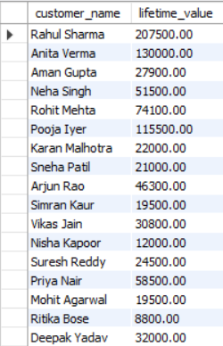

# Customer Retention & Revenue Optimization Analysis (SQL)

## Objective
Analyze customer behavior and revenue patterns using SQL to support data-driven business decisions.

## Tools Used
- MySQL
- MySQL Workbench
- Visual Studio Code
- GitHub

## Dataset
Customers, Orders, Products, Order_Items

## Key KPIs & Analysis

- Average Order Value (AOV)
- Customer Lifetime Value (CLV)
- Customer Cohort Retention Analysis
- Revenue Concentration (Top 20% Customers)
- CLV-Based Customer Segmentation
- Product Cross-Sell Strength
- Customer Purchase Velocity

## 📊 Key KPIs & Advanced SQL Analysis

This project focuses on **customer retention, revenue optimization, and behavioral analysis** using advanced SQL techniques such as CTEs, window functions, self joins, and conditional logic.  
Below are the key KPIs analyzed along with their business relevance.

---

### 1️⃣ Customer Lifetime Value (CLV)

**What it shows:**  
Total revenue generated by each customer across their lifetime.

**Why it matters:**  
Helps identify high-value customers for loyalty programs and targeted marketing.

---

### 2️⃣ Average Order Value (AOV)

**What it shows:**  
Average revenue generated per order.

**Why it matters:**  
Improving AOV directly increases revenue without acquiring new customers.

---

### 3️⃣ Revenue Concentration – Top 20% Customers

**What it shows:**  
Revenue contribution from the top 20% highest-spending customers.

**Why it matters:**  
Highlights dependency risk and the importance of retaining high-value customers.

---

### 4️⃣ Product Cross-Sell Strength (Product Pair Analysis)

**What it shows:**  
Frequently purchased product combinations using self-joins on order data.

**Why it matters:**  
Supports bundle creation, cross-selling strategies, and recommendation systems.

---

### 5️⃣ Customer Cohort Retention Analysis

**What it shows:**  
Tracks how many customers from a given cohort return in subsequent months.

**Why it matters:**  
Reveals customer drop-off patterns and long-term retention behavior.

---

### 6️⃣ Customer Lifetime Value Segmentation

**What it shows:**  
Segmentation of customers into High, Medium, and Low value groups based on CLV.

**Why it matters:**  
Enables differentiated marketing strategies and resource allocation.

---

### 7️⃣ Customer Purchase Velocity

**What it shows:**  
Average number of days between consecutive purchases for each customer.

**Why it matters:**  
Identifies highly engaged customers versus dormant or low-engagement users.

---

## Data Outputs
- KPI results exported as JSON files for structured reporting and visualization

## SQL Concepts
JOINs, GROUP BY, CASE  
Subqueries, Window Functions

## Key Insights
- Repeat customers drive higher revenue
- Revenue is concentrated among few products
- Retention strategies offer better ROI than acquisition

## Author
Akshant Kumar
